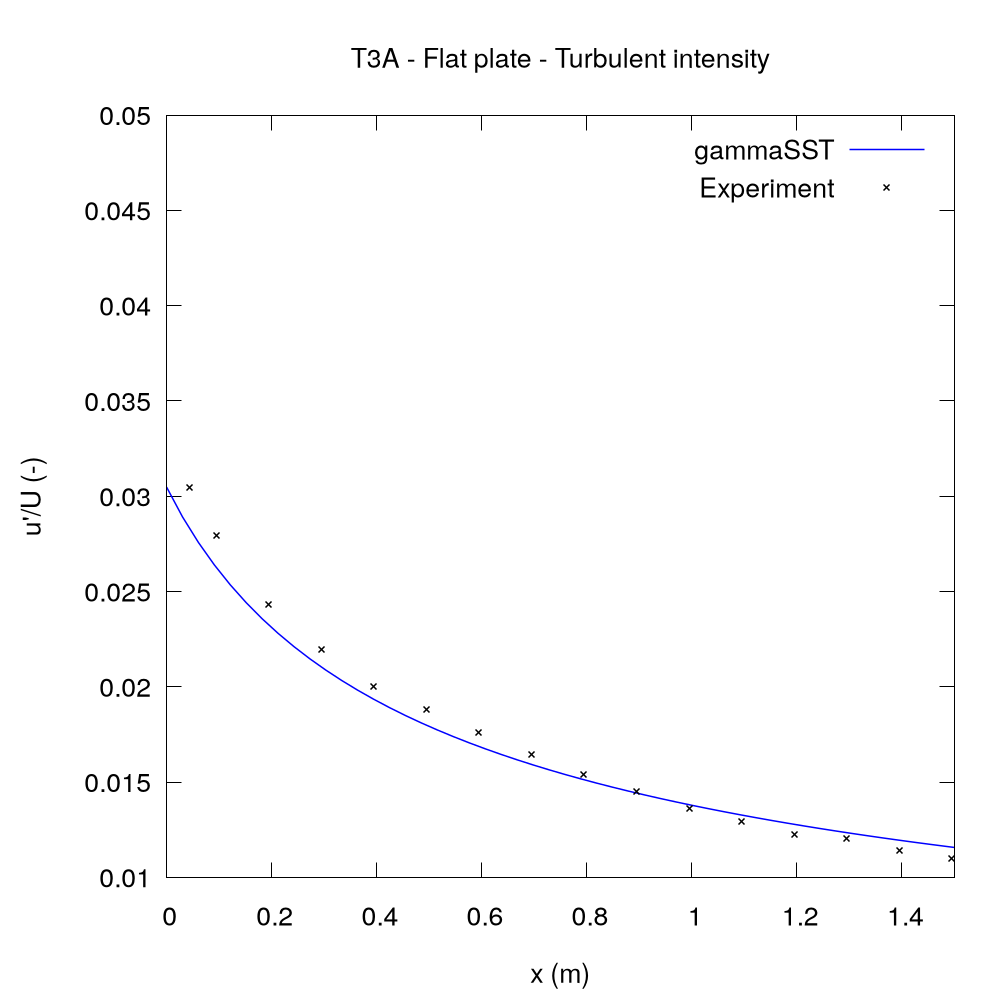

# Flat plate transitional boundary layer - T3A case

Flat-plate transitional 2D boundary layers flows without pressure gradient.

The flat plate $3 m$ long starts at $x=0.04 m$. The leading edge is circular arc with readius $7.5 mm$. The domain extends up to $1 m$ from the flat plate.

## Boundary conditions
- Inlet velocity $U = 5.18$ $ms^{-1}$
- Turbulence intesity at the inlet (i.e. $0.04 m$ before the plate) $I = 3.3\%$
- Turbulent/laminar viscosity ratio at the inlet $\nu_t/\nu = 12$.

## Expected results

## References:
- [ERCOFTAC T3A 3% test-case](http://cfd.mace.manchester.ac.uk/ercoftac/doku.php?id=cases:case020)
- SAVILL, A. M. Some recent progress in the turbulence modelling of by-pass transition. *Near-wall turbulent flows*, 1993, 829-848.
- SAVILL, A. M., 1996. One-Point Closures Applied to Transition. *In: HALLBÄCK, M., HENNINGSON, D.S., JOHANSSON, A.V., ALFREDSSON, P.H. (ed.), Turbulence and Transition Modelling*. Springer, Dordrecht. p. 233–268, doi:10.1007/978-94-015-8666-5_6.
